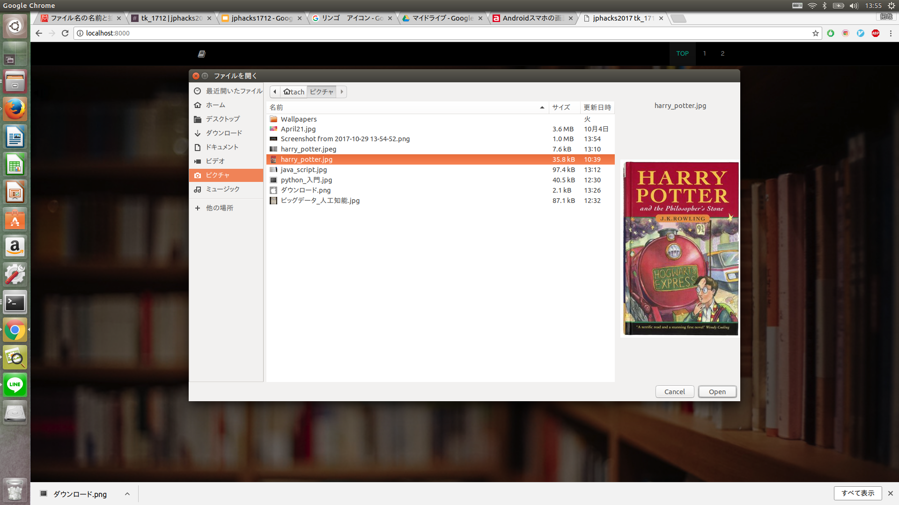
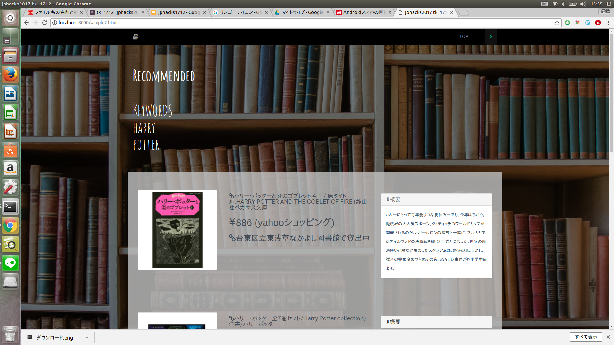
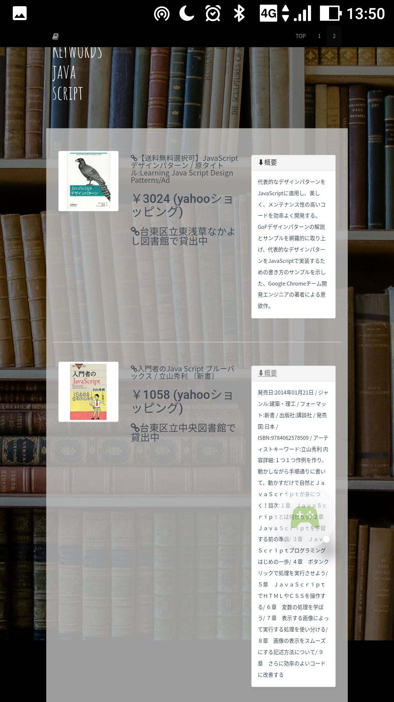

# Look Book

## 製品概要
本の内容から関連する書籍を探し推薦するWEBアプリケーション
### Book X Tech

### 背景（製品開発のきっかけ、課題等）
現在、世の中は情報科学の発達により簡単に本を手に入れられる機会が増えているにもかかわらず、**読書離れ**が問題になっている。

実際に、[文部科学省のサイト](http://www.mext.go.jp/b_menu/shingi/bunka/toushin/04020301/008.htm)にも  
昨今「読書離れ」が叫ばれて久しいが、これからの時代を考えるとき，読書の重要性が増すことはあっても減ることはない。情報化社会の進展は、自分でものを考えずに断片的な情報を受け取るだけの受け身の姿勢を人々にもたらしやすい。自分でものを考える必要があるからこそ、読書が一層必要になるのである。  
と述べられている。

[文化庁の平成25年度の世論調査](http://www.bunka.go.jp/tokei_hakusho_shuppan/tokeichosa/kokugo_yoronchosa/pdf/h25_chosa_kekka.pdf)においても"読書量は以前に比べて減っているか、増えているか。"という問いに対しても「読書量は減っている」と，65.1％が回答している。しかし、一方で"自分の読書量を増やしたいと思うか。"という問いに対しては「増やしたいと思う（計）」と66.3％が回答している。これは機会さえあれば本を読みたいと考えてる人が多いことを示しているのではないだろうか。  

そこで私たちは、本をもっと手に取りやすくするために、なかなか興味のある本に出会えない人や本を探すのが面倒くさい人が、興味のある内容について書かれている本を**もっと簡単に**探すことができたら、本を読むことができるのではないかと考えた。

**情報化社会と本を共存させていく**、これが私たちの開発のテーマ、Book X Techである。

### 製品説明（具体的な製品の説明)
このWEBアプリケーションは本を推薦してくれるもの。  
例えばある本を読んでいて、その内容についてもっと知識を深めたいと思った時に、関連する内容の本を推薦する。

文が表示されている画像をアップロードすると、その文のキーワードを抽出しキーワードからお勧めの本を探し出す。  
文が写っている写真であれば、電子書籍で読んでいる本のスクリーンショットや、ノートの文字、大学のレジュメの写真などでも、関連本を検索することは可能になる。

最終的に関連本に対して、本のタイトル、価格、概要、Yahoo!ショッピングのサイトと、その本を借りることができる、現在地から割り出された近くの図書館が表示される。貸出中かどうかもわかる。

具体的には、

このページで画像をアップロードすると...

このように

オススメの書籍が表示される。

モバイル版も対応している。

### 特長
#### 1. 画像をアップロードするだけ！
ユーザーに必要なのは写真をアップロードすることだけ！あとの作業は全部このアプリがやってくれる。
また、WEBアプリケーションなので携帯からでもパソコンからでも簡単にアクセスできる。

#### 2. 図書館の情報が得られる！
Yahoo!ショッピングで提案するだけでなく、図書館も表示させることでより手軽に本を読むことができる。  
図書館を提案することで、ネットショッピングには手を出しにくい子供にも手軽に本を読んでもらえるようになっている。

#### 3. 現在地から自動で近くの図書館を探している！
図書館は現在地からでてくるので、わざわざ場所等を検索する必要がない。

### 解決出来ること
* 読書離れ対策
  * 興味のある本を探すことが簡単になることで、読みたい本が増え読書量が増える。
  * 図書館も提案することによって、同じお金で読める本の数が増える。
* 本の買いすぎを防ぐ
  * 現在、ネットショッピングの発達などにより昔より簡単に本が手に入るようになった。しかし、一方で簡単に手に入れることができるからこそ、ものの買いすぎが問題になっている。このアプリでは借りられる図書館も提案することによって、本の買いすぎを防いでくれる。
  * 本の買いすぎを防ぐことによって、紙の資源の無駄遣いを防ぐ。
* より興味のある本にであえる
  * 一つのキーワードではなく複数のキーワードで検索しているので、表示できる本の幅が広がる。かと言って無関係な本を表示するわけではない。
  * たとえば本屋さんで気になる本があったとき、その本の表紙や中身の画像をアップロードすれば、関連する他の本もチェックできる。購入前に他の本と比較できる。
* 知識が深まる
  * たとえ一冊の本からでも知識を広げていくことが可能になる。読了しそうな本の表紙や中身の写真をアップロードすれば、そこにある文字列に関連したキーワードから、次に読むべき一冊も表示してくれる。
* 最初の一冊がわからないときに助かる
  * 良い本に出会うためには良いキーワードで検索しなければならない。しかしさっぱりわからないものについて調べるのは困難ではないか？　そんな時このアプリは役に立つ。
  * 例えば学校の授業で 特に教科書等は紹介されなかったけど何か参考になる本を読みたいなあ... という時、自分のノートの画像をアップロードすれば授業内容に関連した本を推薦してくれる。手書き文字にも対応している！

### 今後の展望
* 個人の読書傾向に合わせて推薦の精度をあげる。
  * 人工知能を使い学習させる。
* より読書の量が増えるように、本の感想を投稿する機能などを用意してSNS要素を入れる。
  * SNS要素を入れることによって、大勢で本について語り合う機会を増やす。
* 乱れた手書きにも対応できるようにする。
  * 授業のノートなどから関連書籍を探したい時に、乱れた手書き文字でも認識できるように文字認識の精度をあげる。
* 本同士の関係性をグラフにする。
  * 本同士の関係性をグラフにすることによって、より興味のある本を簡単に見つけられる。
* その画像に含まれないが関連度の高いキーワードを持ってきて検索する。
  * Wikipediaのページのグラフや単語の辞書などを利用する。

## 開発内容・開発技術
### 活用した技術

#### API・データ 
* goo API: [キーワード抽出API](https://labs.goo.ne.jp/api/jp/keyword-extraction/)
* Google Cloud Platform: [Google Cloud Vision 文字認識 API](https://cloud.google.com/vision/?hl=ja)
* [Google Books APIs](https://developers.google.com/books/)
* Yahoo API:  [検索 API](https://developer.yahoo.co.jp/webapi/shopping/shopping/v1/itemsearch.html)
* [図書館 API](https://calil.jp/doc/api.html)

#### フレームワーク・ライブラリ・モジュール
* [Bootstrap](http://getbootstrap.com/)
  * CSSフレームワーク
* CGI (Python)
  * ゲートウェイインタフェース規格 (CGI) に準拠したスクリプトをサポートするためのモジュール
* jQuery
  * JavaScriptライブラリ

#### デバイス
* Webアプリケーションのため、ラップトップやスマートフォンなどインターネットの通じる機器にて動く手軽さを重視している。
* ハードウェアデバイスの開発は行っていない。

### 研究内容・事前開発プロダクト（任意）

### 独自開発技術（Hack Dayで開発したもの）
#### 2日間に開発した独自の機能・技術
* 独自で開発したものの内容をこちらに記載してください
  * 本などの画像から文字列を読み取り、キーワードを抽出する。
  * キーワードから本を検索する。
  * 検索した情報から、図書館とショッピングサイトを表示する。
  * 現在地を取得することによってその本が借りられる近くの図書館と、その本が貸出中か否かを表示する。

* 特に力を入れた部分をファイルリンク、またはcommit_idを記載してください（任意）
