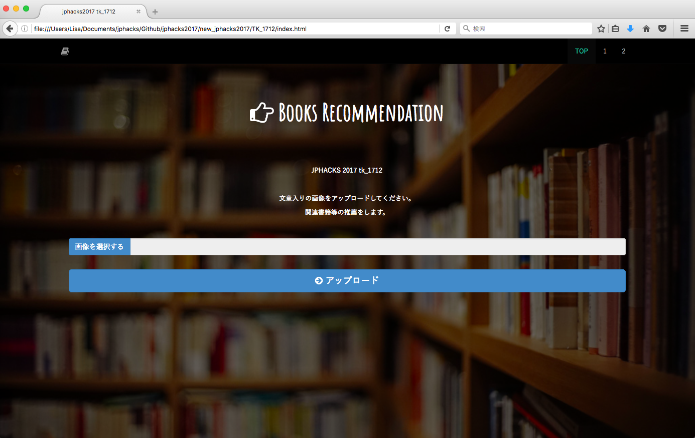

# Look Book

このページで画像をアップロードすると...

## 製品概要
本の内容から関連する書籍を探し推薦するWEBアプリケーション
### Book X Tech

### 背景（製品開発のきっかけ、課題等）
現在、世の中は情報科学の発達により簡単に本を手にれることができる機会が増えているのもかかわらず**読書離れ**が問題になっている。  

実際に、[文部科学省のサイト](http://www.mext.go.jp/b_menu/shingi/bunka/toushin/04020301/008.htm)にも  
昨今「読書離れ」が叫ばれて久しいが，これからの時代を考えるとき，読書の重要性が増すことはあっても減ることはない。情報化社会の進展は，自分でものを考えずに断片的な情報を受け取るだけの受け身の姿勢を人々にもたらしやすい。自分でものを考える必要があるからこそ，読書が一層必要になるのである。  
と述べられている。

[文化庁の平成25年度の世論調査](http://www.bunka.go.jp/tokei_hakusho_shuppan/tokeichosa/kokugo_yoronchosa/pdf/h25_chosa_kekka.pdf)においても"読書量は以前に比べて減っているか，増えているか。"という問いに対しても「読書量は減っている」と，65.1％が回答している。しかし、一方で"自分の読書量を増やしたいと思うか。"という問いに対して「増やしたいと思う（計）」と，66.3％が回答している。これは機会さえあれば本を読みたいと考えてる人が多いことを示しているのではないだろうか。  

そこで私たちは、本をもっと手に取りやすくするためには、なかなか興味のある本に出会えない人や本を探すのが面倒くさい人が、興味のある内容について書かれている本を**もっと簡単に**探すことができたら、本を読むことができるのではないかと考えた。

### 製品説明（具体的な製品の説明)
このWEBアプリケーションは本を推薦してくれるものです。  
例えばある本を読んでいて、その内容についてもっと知識を深めたいと思った時に、関連する内容の本を推薦します。

文章が表示されているページをアップロードすると、その文章のキーワードを抽出しそのキーワードからお勧めの本を探し出します。  
文章が写っている写真であれば、電子書籍で読んでいる本のスクリーンショットや、ノートの文字、大学のレジュメの写真などでも、関連本を検索することは可能になります。

最終的に関連本に対して、Yahoo shoppingのサイトとその本を借りることができる、現在地から割り出された近くの図書館が表示されます。

### 特長
#### 1. 特長1
ユーザーに必要なのは写真をアップロードするだけ！  
また、WEBアプリケーションなので携帯でもパソコンからでも簡単にアクセスできます。

#### 2. 特長2
Yahoo shopping で提案するだけでなく、図書館も表示させることでより手軽に本を読むことができます。  
図書館を提案することで、ネットショッピングがしにくい子供にも手軽に本を読んでもらえるようになっています。

#### 3. 特長3
図書館は現在地からでてくるので、わざわざ場所等を検索必要がありません。

### 解決出来ること
* 読書離れ対策
  * 興味のある本を探すことが簡単になることによって、読みたい本が増え読書量が増える。
  * 図書館も提案することによって、読みたい本を手軽に読める環境が整う。
* 本の買いすぎを防ぐ
  * 現在、ネットショッピングの発達などにより昔より簡単に本が手に入るようになった。しかし、一方で簡単に手に入れることができるからこそ、ものの買いすぎが問題になっている。このアプリでは借りれる図書館も提案することによって、本の買いすぎを防いでくれる。
  * 本の買いすぎを防ぐことによって、紙の資源の無駄遣いを防ぐ。
* より興味のある本にであえる
  * たとえばアマゾンのプレビューなどでスクリーンショットを撮ってその画像から本を探すことができるので、買う前にいろいろな本を見ることいよって吟味できる。
* 知識が深まる
  * たとえ一冊の本からでも知識を広げていくことが可能になる。

### 今後の展望
* 個人の読書傾向に合わせて推薦の精度をあげる。
  * 人工知能を使い学習させる。
* より読書の量が増えるように、本の感想などを投稿しSNS要素を入れる。
  * SNS要素を入れることによって、大勢で本について語り合う機会を増やす。
* 乱れた手書きもににも対応できるようにする。
  * 授業のノートなどから関連書籍を探したい時に、乱れた手書き文字でも認識できるように文字認識の制度をあげる。
* 本同士の関係性をグラフにする。
  * 本の関係性をグラフにすることによって、より興味のある本を簡単い見つけられる。

## 開発内容・開発技術
### 活用した技術
#### API・データ
今回スポンサーから提供されたAPI、製品などの外部技術があれば記述をして下さい。  

* goo API: [キーワード抽出API](https://labs.goo.ne.jp/api/jp/keyword-extraction/)
* Google Cloud Platform: [Google Cloud Vision 文字認識 API](https://cloud.google.com/vision/?hl=ja)
* [Google Books APIs](https://developers.google.com/books/)
* Yahoo API:  [検索 API](https://developer.yahoo.co.jp/webapi/shopping/shopping/v1/itemsearch.html)
* [図書館 API](https://calil.jp/doc/api.html)

#### フレームワーク・ライブラリ・モジュール
* [Bootstrap](http://getbootstrap.com/)
  * CSSフレームワーク
* CGI (Python)
  * ゲートウェイインタフェース規格 (CGI) に準拠したスクリプトをサポートするためのモジュール
* jQuery
  * JavaScriptライブラリ

#### デバイス
* Webアプリケーションのため、ラップトップやスマートフォンなどインターネットの通じる機器にて動きます。

### 研究内容・事前開発プロダクト（任意）

### 独自開発技術（Hack Dayで開発したもの）
#### 2日間に開発した独自の機能・技術
* 独自で開発したものの内容をこちらに記載してください
  *
    * 図書館情報を出している

* 特に力を入れた部分をファイルリンク、またはcommit_idを記載してください（任意）
  *
